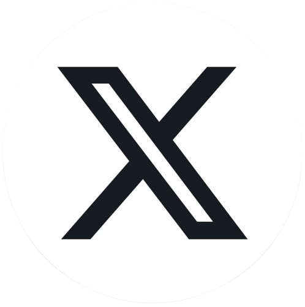

## Follow Me

&nbsp;&nbsp;&nbsp;&nbsp;&nbsp;
  
</a>&nbsp;&nbsp;&nbsp;&nbsp;&nbsp;
  
</a>

 

## Realtime colors 
* It is a color theme picker for making websites or apps
* Link : https://www.realtimecolors.com

## Shape Divider

<!-- Using HTML -->

* It is a css tool to make curved shapes for containers 
* Link : https://www.shapedivider.app/

## Pixcap
* It is a website which gives free and paid 3d icons/Images 
* Link : https://pixcap.com/explore

## Designer tools
* It is a chrome extension which helps in viewing height , width , layout...
* Link : https://designer.tools/

## Mobile simulator responsive testing tool
- It is a chrome extension which helps viewing our web page in different devices 
- Link : https://chromewebstore.google.com/detail/mobile-simulator-responsi/ckejmhbmlajgoklhgbapkiccekfoccmk 

## Thunder Client
- It is a Vs code extension which helps testing our Api's and its a best alternative for postman.
- Link : https://marketplace.visualstudio.com/items?itemName=rangav.vscode-thunder-client 

## Bennetfeely
- It is a clippath generator , clippath is a css property used to make different shapes 
- Link : https://bennettfeely.com/clippy/

